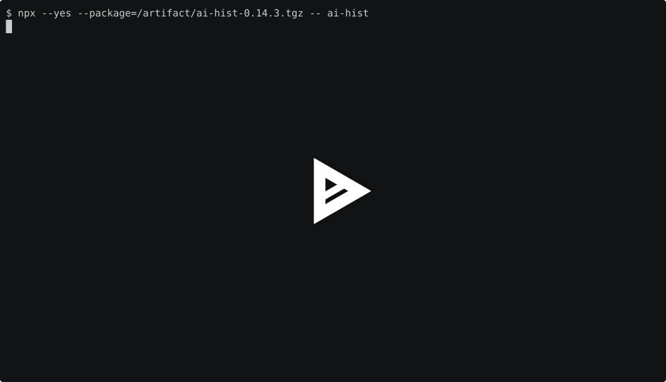
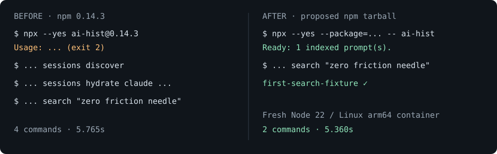

# First-search evidence — 2026-09-08

An actual Docker run measured **5.360 seconds** from the first npx invocation to a successful search returning `first-search-fixture`. Baseline 0.14.3 took 5.765 seconds with an initial usage error followed by explicit discovery and hydration. This demonstrates fewer commands, not a significant speedup over manual indexing.

- Runtime: Node v22.23.2, Debian Trixie, Linux arm64. Image digest, SDK tarball integrity and source revision are in [artifact.json](artifact.json).
- Each run starts a new container with an absent HOME, DB and npm cache. One synthetic Claude session is placed in its normal provider location before the timer starts.
- The timer includes npx installation/dependency downloads, discovery, hydration and the verified first search. The SDK tarball under test is mounted locally; the baseline SDK is downloaded from npm. Image pull and Node/npm installation are excluded. This is a smoke measurement on a tiny fixture, not a guarantee for large histories or every network.
- The proposed SDK tarball uses the published `ai-hist-native@0.14.3`. This does not mean the new bootstrap/pretty commands are already published to npm latest.
- Debian Bookworm arm64 failed: the published native addon requires `GLIBC_2.39`, which Bookworm does not provide. [Failure recording](bookworm-failure.cast). Older glibc systems need a compatible native release; do not infer universal Linux support from this passing Trixie run.

## Reproduce

```sh
npm --prefix sdk-ts run build
docker pull node:22-trixie-slim
node scripts/verify-first-search.mjs /tmp/first-search
```

The script packs the SDK with its release dependency, checks bin resolution and executable shebang, creates fresh containers, saves actual command output as asciinema v2 files, asserts the returned session identity/prompt, and fails when the after run exceeds 30 seconds.

Play [before.cast](before.cast) or [after.cast](after.cast) with `asciinema play FILE`. Timings and command exit statuses are available as [before.json](before.json) and [after.json](after.json). The original cast events are unedited.

## Watch in a browser

[](https://asciinema.org/a/gBZPWgMLugWCA9Vo)

[Before](https://asciinema.org/a/nrKYyxq4KdHEifdr) · [After](https://asciinema.org/a/gBZPWgMLugWCA9Vo)

These anonymous hosted previews expire seven days after upload unless linked to
an asciinema account. The original recordings, preview images and measurements
are committed here permanently and can always be replayed locally.


